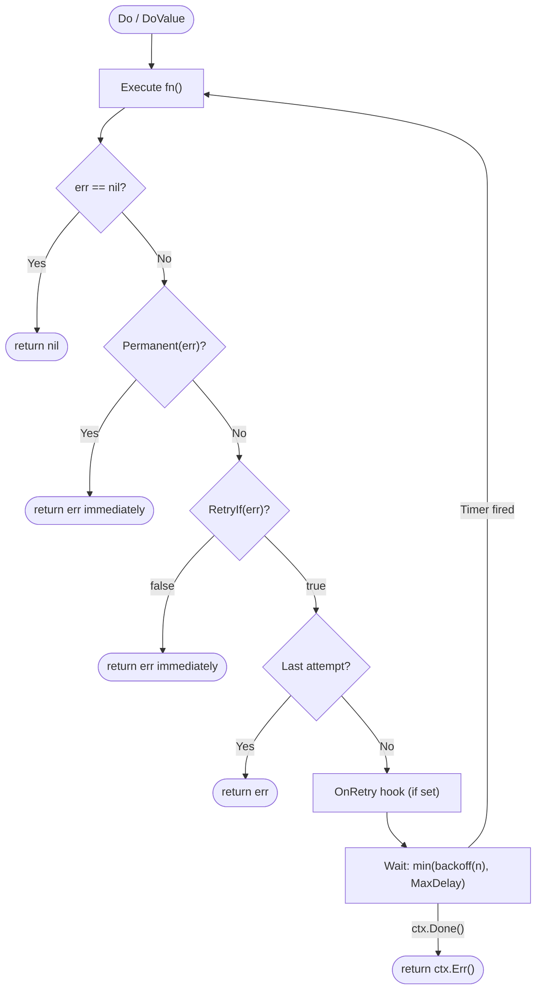

<div align="center">
  
  <h1>🚀 goretry</h1>
  <p><b>A minimal, composable, production-ready retry library for Go.</b></p>

  [](https://github.com/chmenegatti/go-retry/actions/workflows/test.yml)
  [](https://pkg.go.dev/github.com/chmenegatti/go-retry)
  [](https://goreportcard.com/report/github.com/chmenegatti/go-retry)
  [](https://github.com/chmenegatti/go-retry)
  [](LICENSE)
</div>

<br/>

`goretry` provides a clean fluent API for retrying operations in Go. No external dependencies. Race-free. Generics-native.

---

## ✨ Features

| | Feature | Detail |
|---|---|---|
| 🎯 | **Context first** | `ctx.Done()` is checked between every attempt — no blocking sleeps |
| 🔗 | **Fluent API** | `retry.New().Attempts(5).Backoff(ExponentialJitter(200ms)).Do(ctx, fn)` |
| 🧬 | **Generics** | `DoValue[T]` returns typed values — no closures outside the retry loop |
| 🛑 | **Permanent errors** | `retry.Permanent(err)` stops the loop before wasting more attempts |
| 🔍 | **Conditional retry** | `RetryIf(func(error) bool)` — only retry errors you want retried |
| ⏱️ | **MaxDelay** | Cap any backoff strategy at a maximum wait duration |
| 📈 | **4 backoff strategies** | `Constant`, `Linear`, `Exponential`, `ExponentialJitter` — or bring your own |
| 🪝 | **OnRetry hook** | Plug in logging or metrics per attempt |
| ⚡ | **Zero allocations** | ~2.6 ns/op, 0 allocs on the success path |
| 🪶 | **Zero dependencies** | Pure `stdlib`. Ships in `<200 LOC` |

---

## 📦 Installation

```bash
go get github.com/chmenegatti/go-retry
```

> Requires **Go 1.18+**

---

## 💻 Quick Start

```go
import retry "github.com/chmenegatti/go-retry"

err := retry.New().
    Attempts(5).
    Backoff(retry.ExponentialJitter(100 * time.Millisecond)).
    Do(ctx, func() error {
        return callUnstableService()
    })
```

---

## 📖 Usage

### Returning a value

```go
user, err := retry.DoValue(ctx,
    retry.New().Attempts(3),
    func() (*User, error) {
        return db.FindUser(id)
    },
)
```

### Permanent errors — stop immediately from inside fn

```go
err := retry.New().Attempts(5).Do(ctx, func() error {
    resp, err := http.Get(url)
    if err != nil {
        return err // transient — will retry
    }
    if resp.StatusCode == 401 {
        return retry.Permanent(ErrUnauthorized) // fatal — stop now
    }
    return nil
})

// Original error is always preserved
errors.Is(err, ErrUnauthorized) // true
```

### Conditional retry with RetryIf

```go
err := retry.New().
    Attempts(5).
    RetryIf(func(err error) bool {
        // Only retry network timeouts, not application errors
        var netErr net.Error
        return errors.As(err, &netErr) && netErr.Timeout()
    }).
    Do(ctx, fn)
```

### Capped exponential backoff

```go
retry.New().
    Attempts(10).
    Backoff(retry.Exponential(100 * time.Millisecond)).
    MaxDelay(5 * time.Second). // never wait longer than 5s
    Do(ctx, fn)
```

### Logging with OnRetry

```go
retry.New().
    Attempts(5).
    OnRetry(func(attempt int, err error) {
        log.Printf("attempt %d failed: %v", attempt, err)
        metrics.Inc("retry.attempt")
    }).
    Do(ctx, fn)
```

### Real-world examples

<details>
<summary>🌐 HTTP request with server-error retry</summary>

```go
body, err := retry.DoValue(ctx,
    retry.New().
        Attempts(4).
        Backoff(retry.ExponentialJitter(500*time.Millisecond)).
        MaxDelay(10*time.Second).
        RetryIf(func(err error) bool {
            var apiErr *APIError
            if errors.As(err, &apiErr) {
                return apiErr.Code >= 500 // only retry server errors
            }
            return true
        }),
    func() ([]byte, error) {
        resp, err := http.Get("https://api.example.com/data")
        if err != nil {
            return nil, err
        }
        defer resp.Body.Close()
        if resp.StatusCode == 401 {
            return nil, retry.Permanent(ErrUnauthorized)
        }
        if resp.StatusCode >= 400 {
            return nil, &APIError{Code: resp.StatusCode}
        }
        return io.ReadAll(resp.Body)
    },
)
```
</details>

<details>
<summary>🗄️ Database operation</summary>

```go
err := retry.New().
    Attempts(3).
    Backoff(retry.Constant(500 * time.Millisecond)).
    RetryIf(func(err error) bool {
        return isDeadlock(err) // only retry transient DB conflicts
    }).
    Do(ctx, func() error {
        return db.ExecContext(ctx, "UPDATE orders SET status=? WHERE id=?", "shipped", id)
    })
```
</details>

<details>
<summary>⚡ gRPC transient failure</summary>

```go
resp, err := retry.DoValue(ctx,
    retry.New().
        Attempts(5).
        Backoff(retry.ExponentialJitter(100*time.Millisecond)).
        RetryIf(func(err error) bool {
            code := status.Code(err)
            return code == codes.Unavailable || code == codes.DeadlineExceeded
        }),
    func() (*pb.Response, error) {
        return client.Call(ctx, req)
    },
)
```
</details>

---

## 📐 Backoff Strategies

```go
type Backoff func(attempt int) time.Duration // bring your own!
```

| Strategy | Formula | Use case |
|---|---|---|
| `Constant(d)` | `d` | Simple polling, queue consumers |
| `Linear(base)` | `attempt × base` | Gradual ramp-up |
| `Exponential(base)` | `base × 2^(attempt-1)` | Standard retry without jitter |
| `ExponentialJitter(base)` | `[d/2, d]` random | **Recommended** — avoids thundering herd |

---

## ⚙️ API Reference

| Method | Default | Description |
|---|---|---|
| `New()` | — | 3 attempts, 100ms constant backoff |
| `.Attempts(n)` | `3` | Total call count (including first) |
| `.Backoff(b)` | `Constant(100ms)` | Delay strategy between attempts |
| `.MaxDelay(d)` | none | Hard cap applied on top of any backoff |
| `.RetryIf(fn)` | retry all | Predicate — return `false` to stop retrying |
| `.OnRetry(fn)` | none | Hook before each sleep (not on final failure) |
| `.Do(ctx, fn)` | — | Execute and return error |
| `DoValue[T](ctx, r, fn)` | — | Execute and return `(T, error)` |
| `Permanent(err)` | — | Wrap error to abort retry loop immediately |
| `IsPermanent(err)` | — | Check if any error in the chain is permanent |

---

## 🧠 Execution Flow



---

## 🔬 Comparison

| Library | API Style | Generics | Permanent | RetryIf | MaxDelay | Dependencies |
|---|---|---|---|---|---|---|
| **goretry** (this) | Fluent/chain | ✅ | ✅ | ✅ | ✅ | 0 |
| `cenkalti/backoff` | Functional | ❌ | ✅ | ✅ | ✅ | 1 |
| `avast/retry-go` | Functional opts | ❌ | ✅ | ✅ | ✅ | 0 |

---

## 🏗️ Design Philosophy

- **Simplicity over features**: every method on `Retry` is essential and independently useful.
- **No global state**: calling `New()` always returns a fresh independent instance.
- **Context always wins**: the library never blocks on a timer longer than necessary.
- **Errors are values**: `Permanent` is just an error wrapper — no special types to import.
- **Zero allocations on the hot path**: successful calls don't allocate.

---

## 🧪 Testing & Benchmarks

```bash
go test -race -cover ./...
# ok  github.com/chmenegatti/go-retry  coverage: 98.4% of statements

go test -bench=. -benchmem ./...
# BenchmarkRetrySuccess-12   443903150   2.626 ns/op   0 B/op   0 allocs/op
# BenchmarkRetryFailure-12           5   201000864 ns/op  502 B/op   6 allocs/op
```

> ✅ **0 allocations** on the success path — the library is invisible when not needed.

---

## 🤝 Contributing

1. Fork and create a branch: `git checkout -b feat/my-feature`
2. Run tests: `go test -race ./...`
3. Commit: `git commit -am 'feat: ...'`
4. Open a Pull Request

---

## 📄 License

MIT — see [LICENSE](LICENSE).
