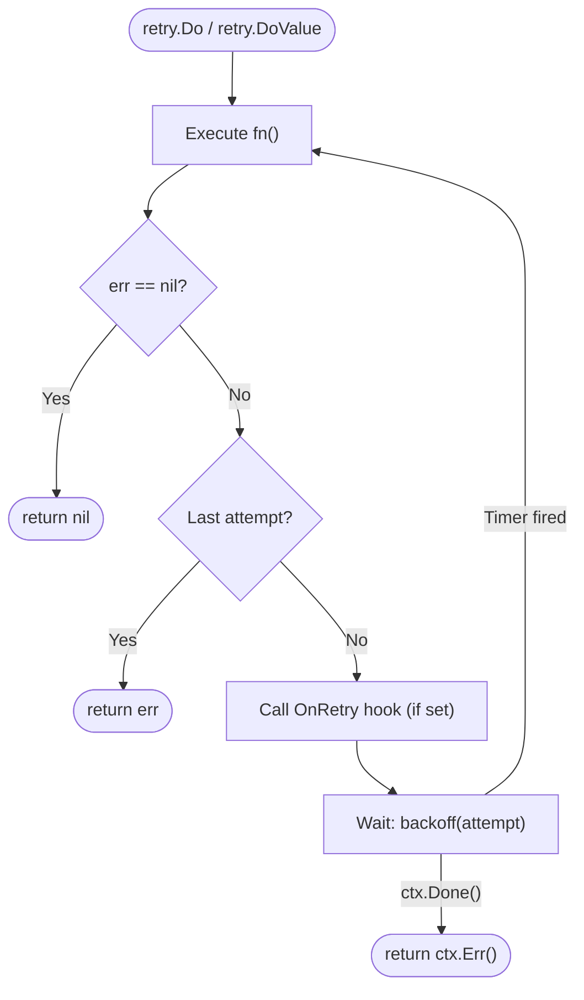

<div align="center">
  
  <h1>🚀 goretry</h1>
  <p><b>A minimal, composable, and production-ready retry library for Go.</b></p>

  [](https://pkg.go.dev/github.com/chmenegatti/go-retry)
  [](https://goreportcard.com/report/github.com/chmenegatti/go-retry)
  [](https://opensource.org/licenses/MIT)
</div>

<br/>

`goretry` is a zero-dependency retry library built around a clean, fluent API. It respects `context.Context` cancellation immediately, supports pluggable backoff strategies, and includes Generics so your functions can return values directly.

---

## ✨ Why `goretry`?

| Feature | Detail |
|---|---|
| 🎯 **Context First** | `ctx.Done()` is respected *between* attempts — no waiting for a long sleep to finish |
| 🔗 **Fluent API** | Method chaining: `retry.New().Attempts(5).Backoff(Exponential(100ms)).Do(ctx, fn)` |
| 🧬 **Generics** | `DoValue[T]` returns values directly — no captures outside the closure |
| 📈 **4 Backoff Strategies** | `Constant`, `Linear`, `Exponential`, `ExponentialJitter` — or bring your own |
| 🪝 **Lifecycle Hook** | `OnRetry(func(attempt int, err error))` for logging and metrics |
| ⚡ **Zero Allocations** | `~2.6 ns/op, 0 allocs/op` on the success path |
| 🪶 **Zero Dependencies** | Pure `stdlib`. No external packages. |

---

## 📦 Installation

```bash
go get github.com/chmenegatti/go-retry
```

> Requires **Go 1.18+** for Generics support.

---

## 💻 Quick Start

### Simple error-only retry

```go
import retry "github.com/chmenegatti/go-retry"

err := retry.New().
    Attempts(5).
    Backoff(retry.ExponentialJitter(100 * time.Millisecond)).
    Do(ctx, func() error {
        return callUnstableService()
    })
```

### Returning a value

Use `DoValue[T]` to return a typed result directly from the retry loop — no variable capture needed:

```go
import retry "github.com/chmenegatti/go-retry"

user, err := retry.DoValue(ctx,
    retry.New().Attempts(3).Backoff(retry.Exponential(200*time.Millisecond)),
    func() (*User, error) {
        return db.FindUser(id)
    },
)
```

### With `OnRetry` for observability

```go
err := retry.New().
    Attempts(5).
    Backoff(retry.ExponentialJitter(100 * time.Millisecond)).
    OnRetry(func(attempt int, err error) {
        log.Printf("⚠️  attempt %d failed: %v", attempt, err)
        metrics.Inc("retry.attempt")
    }).
    Do(ctx, func() error {
        return callUnstableService()
    })
```

### HTTP request with server-error detection

```go
package main

import (
    "context"
    "fmt"
    "io"
    "log"
    "net/http"
    "time"

    retry "github.com/chmenegatti/go-retry"
)

func main() {
    ctx := context.Background()

    body, err := retry.DoValue(ctx,
        retry.New().
            Attempts(4).
            Backoff(retry.ExponentialJitter(500*time.Millisecond)).
            OnRetry(func(attempt int, err error) {
                log.Printf("attempt %d failed: %v", attempt, err)
            }),
        func() ([]byte, error) {
            resp, err := http.Get("https://api.example.com/data")
            if err != nil {
                return nil, err
            }
            defer resp.Body.Close()

            if resp.StatusCode >= 500 {
                return nil, fmt.Errorf("server error: %d", resp.StatusCode)
            }
            return io.ReadAll(resp.Body)
        },
    )
    if err != nil {
        log.Fatalf("all attempts failed: %v", err)
    }
    fmt.Printf("fetched %d bytes\n", len(body))
}
```

---

## 📐 Backoff Strategies

All built-in strategies implement the `Backoff` type:

```go
type Backoff func(attempt int) time.Duration
```

| Strategy | Formula | Description |
|---|---|---|
| `Constant(d)` | `d` | Same delay every time. Predictable, good for simple cases. |
| `Linear(base)` | `attempt × base` | Grows proportionally. `base=500ms`: 500ms → 1s → 1.5s → ... |
| `Exponential(base)` | `base × 2^(attempt-1)` | Doubles each time. `base=100ms`: 100ms → 200ms → 400ms → ... |
| `ExponentialJitter(base)` | `[d/2, d]` random | Exponential + random spread. **Recommended for production.** |

You can also provide any custom function matching `func(attempt int) time.Duration`.

---

## ⚙️ API Reference

### `retry.New() *Retry`

Creates a new `Retry` with defaults: **3 attempts**, **100ms constant backoff**.

### `(*Retry).Attempts(n int) *Retry`

Sets the **total** number of times `fn` is called (including the first). Values `< 1` are treated as `1`.

### `(*Retry).Backoff(b Backoff) *Retry`

Sets the backoff strategy. Use the built-in helpers or a custom function.

### `(*Retry).OnRetry(fn func(int, error)) *Retry`

Registers a callback invoked before each sleep between attempts (not on the final failure).

### `(*Retry).Do(ctx context.Context, fn func() error) error`

Executes `fn` up to the configured number of attempts. Returns `nil` on first success, the last error if all attempts fail, or `ctx.Err()` if the context is cancelled while waiting.

### `retry.DoValue[T](ctx, r, fn) (T, error)`

Generic helper that wraps `Do` and returns a typed value alongside the error.

---

## 🧠 Execution Flow



---

## 🧪 Testing

Run the full test suite with the race detector:

```bash
go test -race -cover ./...
```

```
ok  github.com/chmenegatti/go-retry  coverage: 89.4% of statements
```

Run benchmarks:

```bash
go test -bench=. -benchmem ./...
```

```
BenchmarkRetrySuccess-12   443903150   2.626 ns/op   0 B/op   0 allocs/op
BenchmarkRetryFailure-12           5   201000864 ns/op  502 B/op   6 allocs/op
```

> ✅ **0 allocations** on the success path. The library gets out of the way when it's not needed.

---

## 🤝 Contributing

Pull requests are welcome!

1. Fork it
2. Create your feature branch: `git checkout -b feature/my-feature`
3. Run tests: `go test -race ./...`
4. Commit and push: `git commit -am 'feat: add ...'`
5. Open a Pull Request

---

## 📄 License

MIT. See [LICENSE](LICENSE) for details.
